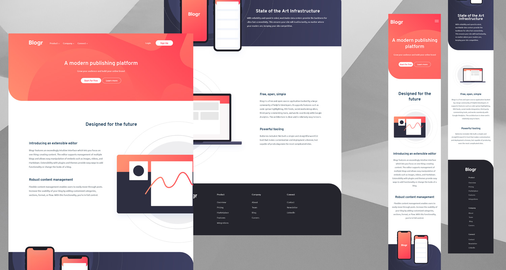

# Frontend Mentor - Blogr landing page solution

This is a solution to the [Blogr landing page challenge on Frontend Mentor](https://www.frontendmentor.io/challenges/blogr-landing-page-EX2RLAApP). Frontend Mentor challenges help you improve your coding skills by building realistic projects. 

## Table of contents

- [Overview](#overview)
  - [The challenge](#the-challenge)
  - [Screenshot](#screenshot)
  - [Links](#links)
- [My process](#my-process)
  - [Built with](#built-with)
  - [Continued development](#continued-development)
- [Author](#author)

## Overview

### The challenge

I should be able to:

- View the optimal layout for the site depending on their device's screen size
- See hover states for all interactive elements on the page

### Screenshot

### Links

- [Solution URL](https://www.frontendmentor.io/solutions/blogr-landing-page-p18AfGgNV)
- [Live Site URL](https://blogr-landing-yaiza.netlify.app/)

## My process
I've done some challenges before but this was the hardest by far. 

I had a lot of problems doing drowdown menu. It took me some hours to adjust the menu without affect the rest of the header flow. I tried to keep the space between the main menu and the drowdown menu but hover effect wasn't working correctly so I had to remove it.
Final result it's not perfect but I think it looks not bad.

Positioning the images of sections was not easy. I needed a lot of changes before getting images with hidden overflow.

### Built with

- BEM methodology
- Flexbox
- CSS custom properties

### Continued development

This was my first project using JS. It is only a tiny bit for the mobile version so I would like to keep improving this part.

I want to learn better the BEM methodology and be able to implement it correctly.

## Author
- Frontend Mentor - [@yaiza16](https://www.frontendmentor.io/profile/Yaiza16)
- LinkedIn - [Yaiza Vallejo](https://www.linkedin.com/in/yaizavc/)
